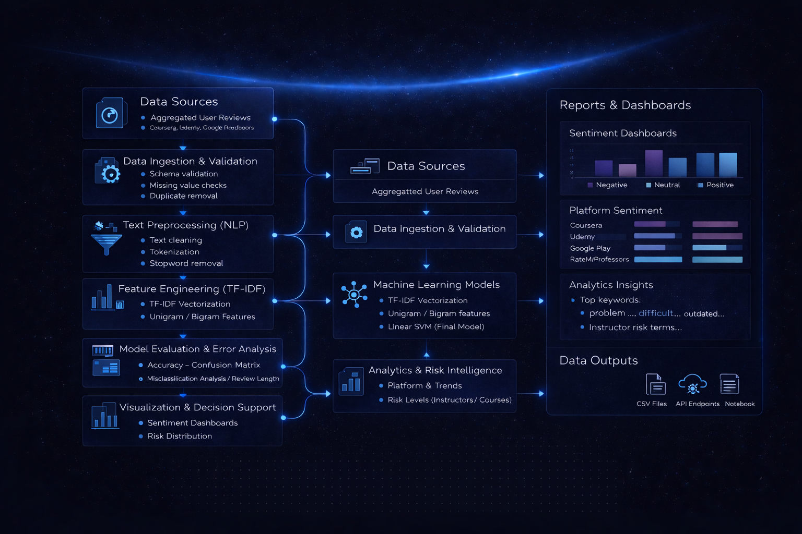

#### Project Overview

This project presents a large-scale sentiment intelligence system built to analyze user reviews from multiple online learning platforms, including Coursera, Udemy, Google Play, and RateMyProfessors.
Using Natural Language Processing (NLP) and Machine Learning, the system extracts sentiment patterns, evaluates model performance, and derives actionable business insights at the platform, course, and instructor levels.

The solution goes beyond basic sentiment classification by integrating:

- Advanced text preprocessing

- Cross-platform analytics

- Error analysis

- Risk-level assessment for courses and instructors

#### Project Architecture

#### Objectives

- Perform sentiment classification (Negative, Neutral, Positive) on learning platform reviews

- Compare multiple ML models for sentiment prediction

- Analyze review behavior patterns (length, keywords, ambiguity)

- Identify high-risk courses and instructors

- Evaluate AI-related feedback trends

- Deliver decision-ready analytics outputs

#### Datasets Used

| Platform             | Records                  |
|----------------------|--------------------------|
| Coursera             | 12,000                   |
| Udemy                | 15,000                   |
| Google Play Reviews  | 37,427 (after cleaning)  |
| RateMyProfessors     | 10,000                   |
| **Total Reviews**    | **74,427**

-- Key Fields:

- Review text

- Ratings (where applicable)

- Platform

- Course

- Instructor

- Derived sentiment labels

#### Text Preprocessing Pipeline

- Lowercasing

- URL & emoji removal

- Punctuation & digit cleaning

- Tokenization

- Stopword removal

- Lemmatization

- Review length feature engineering

This ensures clean, consistent, and model-ready text across all platforms.

#### Sentiment Labeling Strategy

| **Rating** | **Sentiment** |
|------------|---------------|
| 1–2        | Negative      |
| 3          | Neutral       |
| 4–5        | Positive      |

Google Play sentiment labels were mapped directly from the dataset.

#### Feature Engineering

- TF-IDF Vectorization

- Unigrams

- Bigrams (for comparison)

- Vocabulary pruning using min_df and max_df

- Sparse matrix optimization

#### Models Evaluated

| **Model**               | **Features**        | **Accuracy** |
|-------------------------|---------------------|--------------|
| Logistic Regression     | Unigram TF-IDF      | ~0.93        |
| Naive Bayes             | Unigram TF-IDF      | ~0.87        |
| **Linear SVM (Best)**   | **Unigram TF-IDF**  | **~0.95**    |
| Logistic Regression     | Bigram TF-IDF       | ~0.93        |

Linear SVM achieved the best balance of accuracy, stability, and interpretability

#### Model Evaluation Summary

- Overall Accuracy: ~94.7%

- Strong diagonal dominance in confusion matrix

- Neutral sentiment shows highest ambiguity

- Negative reviews are longer and semantically richer

- Misclassifications driven by language complexity, not model bias

#### Risk Analytics

-- Course Risk Levels

- Low Risk: Majority of courses

- Medium Risk: Content pacing or clarity issues

- High Risk: Outdated material, unclear instruction, poor structure

-- Instructor Risk Levels

- Enables data-driven instructor evaluation

- Identifies recurring dissatisfaction patterns

#### Business Insights

- Positive sentiment dominates across platforms

- Negative feedback is systematic and content-driven

- AI features are well-received but require refinement

- Review length is a strong indicator of sentiment intensity

- NLP analytics can support quality monitoring and optimization

#### How to Run

    pip install -r requirements.txt

    jupyter notebook

Open and run:

    learning_platforms_analysis_code.ipynb

#### Contributing

Contributions, improvements, and extensions are welcome.
Feel free to fork the repository and submit a pull request.
